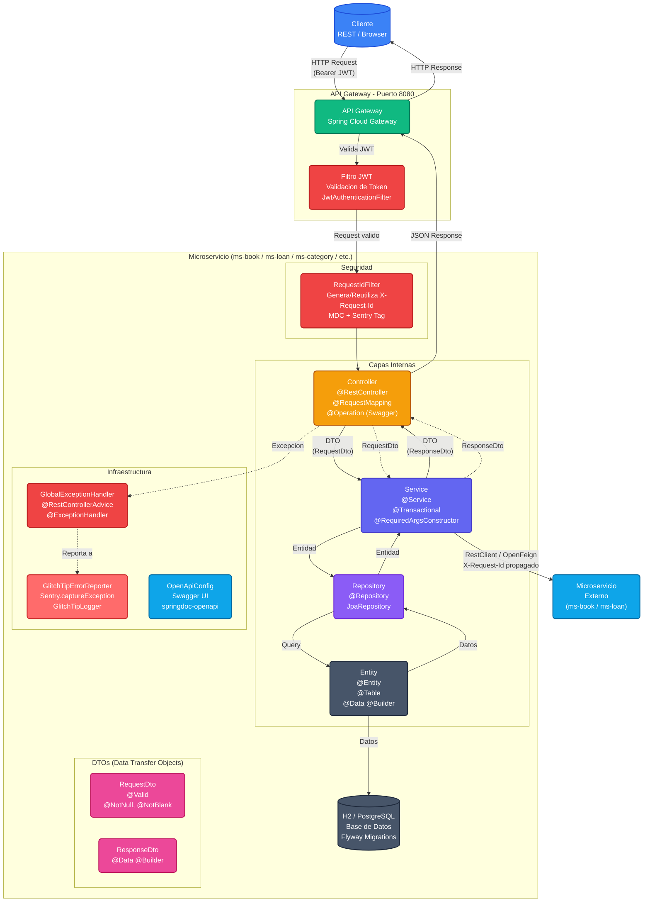

# Diagramas de Arquitectura - Lexicon

## Diagrama C2 (Contenedores) - Simplificado

Muestra la infraestructura general del sistema con cada bloque indicando: Nombre, Tecnologia, Puerto y Base de Datos.

```mermaid
flowchart TD
    %% Estilos
    classDef client fill:#3B82F6,stroke:#1D4ED8,stroke-width:2px,color:#FFF,rx:8px,ry:8px
    classDef gateway fill:#10B981,stroke:#047857,stroke-width:2px,color:#FFF,rx:8px,ry:8px
    classDef auth fill:#EF4444,stroke:#B91C1C,stroke-width:2px,color:#FFF,rx:8px,ry:8px
    classDef infra fill:#8B5CF6,stroke:#6D28D9,stroke-width:2px,color:#FFF,rx:8px,ry:8px
    classDef ms fill:#6366F1,stroke:#4338CA,stroke-width:2px,color:#FFF,rx:8px,ry:8px
    classDef bff fill:#F59E0B,stroke:#B45309,stroke-width:2px,color:#FFF,rx:8px,ry:8px
    classDef db fill:#475569,stroke:#1E293B,stroke-width:2px,color:#FFF,rx:12px,ry:12px

    %% Cliente
    Client[Cliente REST\nPostman / Navegador / Swagger]:::client

    subgraph infra ["Infraestructura Core"]
        direction LR
        Gateway["API Gateway\nSpring Cloud Gateway MVC\nPuerto: 8080\nSin BD"]:::gateway
        Eureka["Eureka Server\nSpring Cloud Netflix\nPuerto: 8761\nH2 (registry)"]:::infra
    end

    subgraph auth_layer ["Servicio de Autenticacion"]
        direction TB
        AuthService["Auth Service\nSpring Security + JJWT\nPuerto: 8081\nH2: authdb"]:::auth
        DBAuth[("H2\nauthdb")]:::db
    end

    subgraph domain ["Microservicios de Dominio"]
        direction TB
        subgraph row1 [" "]
            direction LR
            BookSvc["ms-book\nSpring Boot + JPA\nPuerto: 8082\nH2: bookdb"]:::ms
            LoanSvc["ms-loan\nSpring Boot + JPA\nPuerto: 8083\nH2: loandb"]:::ms
            CustSvc["ms-customer\nSpring Boot + JPA\nPuerto: 8084\nH2: customerdb"]:::ms
        end
        subgraph row2 [" "]
            direction LR
            CatSvc["ms-category\nSpring Boot + JPA\nPuerto: 8086\nH2: categorydb"]:::ms
            ResSvc["ms-reservation\nSpring Boot + JPA\nPuerto: 8087\nH2: reservationdb"]:::ms
            NotSvc["ms-notification\nSpring Boot + JPA\nPuerto: 8088\nH2: notificationdb"]:::ms
        end
        subgraph row3 [" "]
            direction LR
            PenSvc["ms-penalty\nSpring Boot + JPA\nPuerto: 8089\nH2: penaltydb"]:::ms
            RepSvc["ms-report\nSpring Boot + JPA\nPuerto: 8090\nH2: reportdb"]:::ms
        end
    end

    subgraph bff_layer ["Servicio BFF"]
        BFF["BFF Service\nSpring Boot + OpenFeign\nPuerto: 8085\nSin BD"]:::bff
    end

    %% Bases de datos de dominio
    DBBook[("H2\nbookdb")]:::db
    DBLoan[("H2\nloandb")]:::db
    DBCust[("H2\ncustomerdb")]:::db
    DBCat[("H2\ncategorydb")]:::db
    DBRes[("H2\nreservationdb")]:::db
    DBNot[("H2\nnotificationdb")]:::db
    DBPen[("H2\npenaltydb")]:::db
    DBRep[("H2\nreportdb")]:::db

    %% Comunicacion Cliente -> Gateway
    Client == "POST /login\nGET /api/v1/*\n(Bearer JWT)" ==> Gateway

    %% Gateway -> Servicios
    Gateway -- "/login" --> AuthService
    Gateway -- "/api/v1/books/**" --> BookSvc
    Gateway -- "/api/v1/loans/**" --> LoanSvc
    Gateway -- "/api/v1/customers/**" --> CustSvc
    Gateway -- "/api/v1/categories/**" --> CatSvc
    Gateway -- "/api/v1/reservations/**" --> ResSvc
    Gateway -- "/api/v1/notifications/**" --> NotSvc
    Gateway -- "/api/v1/penalties/**" --> PenSvc
    Gateway -- "/api/v1/reports/**" --> RepSvc
    Gateway -- "/api/v1/bff/**" --> BFF

    %% BFF -> Servicios internos
    BFF -. "OpenFeign" .-> BookSvc
    BFF -. "OpenFeign" .-> LoanSvc

    %% Persistencia
    AuthService --- DBAuth
    BookSvc --- DBBook
    LoanSvc --- DBLoan
    CustSvc --- DBCust
    CatSvc --- DBCat
    ResSvc --- DBRes
    NotSvc --- DBNot
    PenSvc --- DBPen
    RepSvc --- DBRep

    %% Registro en Eureka
    AuthService -.- Eureka
    BookSvc -.- Eureka
    LoanSvc -.- Eureka
    CustSvc -.- Eureka
    CatSvc -.- Eureka
    ResSvc -.- Eureka
    NotSvc -.- Eureka
    PenSvc -.- Eureka
    RepSvc -.- Eureka
    BFF -.- Eureka
    Gateway -.- Eureka
```

---

## Diagrama C3 (Componentes)

Muestra la estructura interna de los microservicios con sus capas, seguridad JWT, DTOs y comunicacion externa.

### Leyenda de Colores

| Color | Componente |
|-------|------------|
| Azul | Cliente externo |
| Verde | API Gateway |
| Rojo | Seguridad (JWT Filter, RequestIdFilter) |
| Naranja | Controller |
| Rosa | DTOs (RequestDto, ResponseDto) |
| Indigo | Service |
| Violeta | Repository |
| Gris oscuro | Entity, Base de Datos |
| Celeste | Microservicio externo / OpenAPI |
| Rojo claro | GlitchTip / Sentry |

### Flujo de Comunicacion

1. **Entrada**: Cliente envia HTTP Request con Bearer JWT al API Gateway
2. **Validacion**: Gateway valida el JWT via JwtAuthenticationFilter
3. **Filtrado**: RequestIdFilter genera/reutiliza X-Request-Id y lo propaga via MDC
4. **Controller**: Recibe la request, valida con @Valid, convierte DTO a entidad
5. **Service**: Logica de negocio con @Transactional
6. **Repository**: Acceso a datos via JpaRepository
7. **Entity**: Mapeo JPA a la tabla de la BD
8. **Respuesta**: Se arma ResponseDto y se devuelve por las capas inversas
9. **Error**: Si hay excepcion, GlobalExceptionHandler la captura y la reporta a GlitchTip
10. **Externo**: El Service puede comunicarse con otros MS via RestClient/OpenFeign, propagando X-Request-Id
