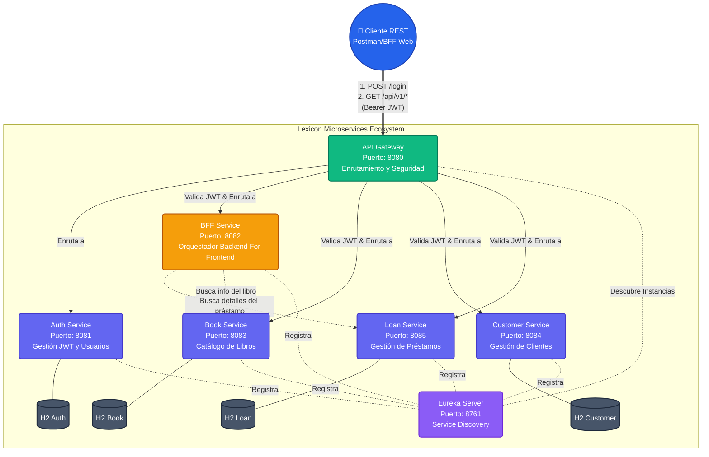

# Arquitectura C3 - Lexicon Project

Este documento ilustra la arquitectura de microservicios de **Lexicon** utilizando el estándar de diagramas de contenedores (C4 Model) implementado a través de Mermaid.JS. 

## Diagrama de Contenedores

## Flujos de Negocio Destacados

1. **Flujo de Autenticación**: El usuario envía credenciales (`/login`) al `API Gateway`. El Gateway ruteará la petición directamente al `Auth Service`, quien verifica la Base de Datos y devuelve un JWT firmado mediante `HMAC-SHA384`.
2. **Seguridad Centralizada**: Toda petición (excepto login) es interceptada por el `API Gateway`, que parsea y valida criptográficamente el JWT. Si es inválido, rechaza la petición (`401 Unauthorized`) antes de que toque los microservicios, aliviando la carga.
3. **Flujo del BFF**: Cuando se consulta un préstamo consolidado, el `BFF Service` hace peticiones asíncronas internas a `ms-loan` y `ms-book` para armar un payload complejo, devolviéndolo listo para que el Frontend lo consuma sin hacer múltiples peticiones.
4. **Service Discovery**: Ningún servicio conoce la IP del otro. Todos se registran en `Eureka` y se comunican resolviendo los nombres de registro (e.g. `http://MS-BOOK/`).
